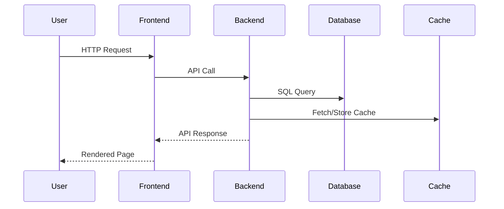

# Architecture

## System Design

The system consists of a frontend client built with Next.js and a backend API built with FastAPI. Data persistence is managed through PostgreSQL with caching via Redis. The entire system is containerized using Docker and orchestrated with Docker Compose.

## Components

- **Frontend (Next.js)**: Provides a responsive and dynamic user interface using React, TypeScript, and Tailwind CSS.
- **Backend (FastAPI)**: Handles RESTful API requests, user authentication, and business logic.
- **Database (PostgreSQL)**: Stores user data, tasks, and categories.
- **Cache (Redis)**: Used for session management and caching frequently accessed data.
- **Nginx**: Serves as a reverse proxy to manage incoming traffic and direct it to the appropriate service.

## Data Flow

## Infrastructure

The infrastructure is hosted on a cloud environment with CI/CD pipelines managed through GitHub Actions. Docker containers ensure consistent environments across development and production.