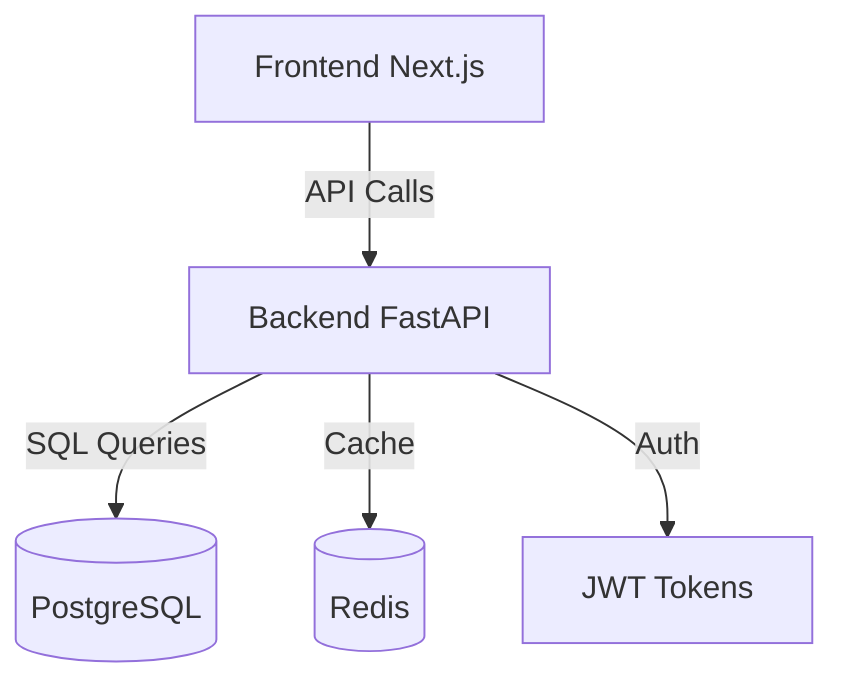

# TaskMaster Pro

[](LICENSE)
[](#)

Effortlessly organize and prioritize your daily tasks.

## Features

- ✓ User Registration and Login
- ✓ Create and Manage Tasks
- ✓ Task Prioritization
- ✓ Task Reminders
- ✓ Task Categories
- ✓ Search and Filter Tasks
- ✓ Task Sharing
- ✓ Progress Tracking
- ✓ Mobile Responsiveness
- ✓ Data Security

## Quick Start

```bash
# Clone the repository
git clone https://github.com/example/taskmaster-pro.git

# Navigate into the directory
cd taskmaster-pro

# Start the application using Docker Compose
docker-compose up --build
```

## Prerequisites

| Tool          | Version     |
|---------------|-------------|
| Docker        | 20.10.7+    |
| Docker Compose| 1.29.2+     |
| Node.js       | 16.0.0+     |
| Python        | 3.9+        |

## Complete Docker Compose Setup

```yaml
version: '3.8'
services:
  web:
    build: .
    ports:
      - "3000:3000"
    environment:
      - DATABASE_URL=postgresql://postgres:[password]@db:5432/taskmaster
      - REDIS_URL=redis://redis:6379
    depends_on:
      - api
  api:
    build:
      context: ./backend
    environment:
      - DATABASE_URL=postgresql://postgres:[password]@db:5432/taskmaster
      - REDIS_URL=redis://redis:6379
    ports:
      - "8000:8000"
    depends_on:
      - db
      - redis
  db:
    image: postgres:15
    environment:
      POSTGRES_USER: postgres
      POSTGRES_PASSWORD: [password]
      POSTGRES_DB: taskmaster
    volumes:
      - db_data:/var/lib/postgresql/data
  redis:
    image: redis:7
    ports:
      - "6379:6379"
volumes:
  db_data:
```

## API Usage Examples

### Register a New User

```bash
curl -X POST "http://localhost:8000/api/v1/auth/register" \
-H "Content-Type: application/json" \
-d '{"email":"user@example.com", "password":"password123"}'
```

### Create a New Task

```bash
curl -X POST "http://localhost:8000/api/v1/tasks" \
-H "Authorization: Bearer [access_token]" \
-H "Content-Type: application/json" \
-d '{"title":"New Task", "due_date":"2023-11-01", "priority":"high"}'
```

## Environment Variables

| Name            | Required | Default                        | Description                                   |
|-----------------|----------|--------------------------------|-----------------------------------------------|
| DATABASE_URL    | Yes      |                                | The database connection URL                   |
| REDIS_URL       | Yes      | redis://localhost:6379         | The Redis connection URL                      |
| ACCESS_SECRET   | Yes      |                                | Secret key for generating access tokens       |
| REFRESH_SECRET  | Yes      |                                | Secret key for generating refresh tokens      |

## Architecture Diagram



## Tech Stack

| Component     | Technology                     |
|---------------|--------------------------------|
| Backend       | Python, FastAPI                |
| Frontend      | Next.js, TypeScript, Tailwind CSS |
| Database      | PostgreSQL, Redis              |
| Infrastructure| Docker, Docker Compose, Nginx  |

## License

TaskMaster Pro is licensed under the [MIT License](LICENSE).

## Documentation

For more detailed documentation, please visit the [docs folder](./docs).